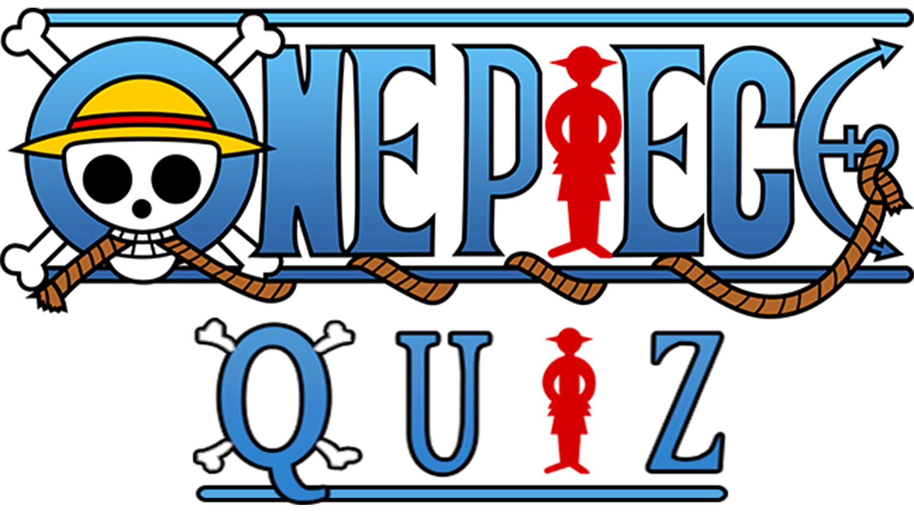
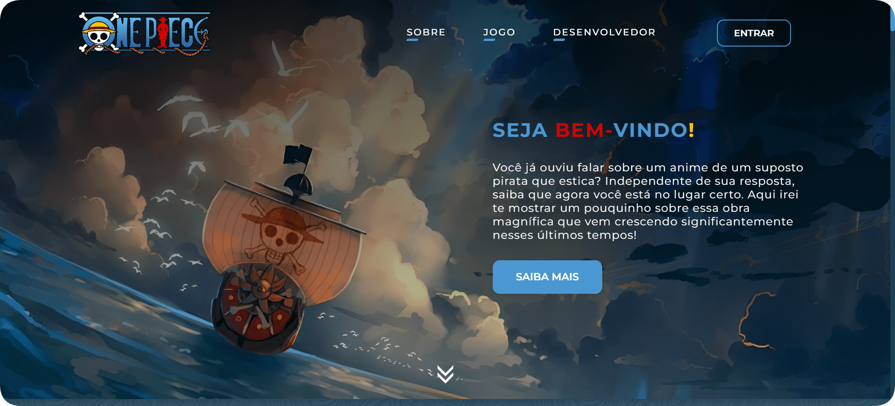
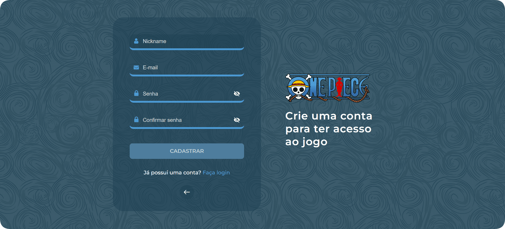
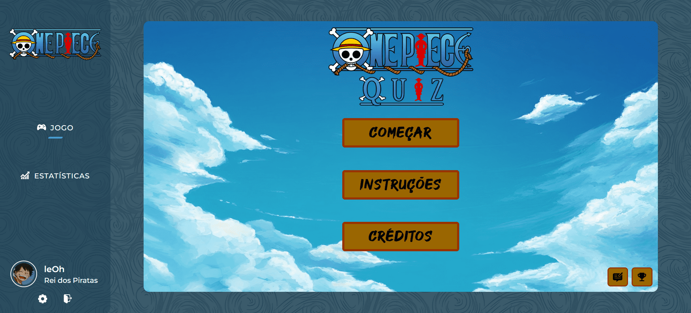
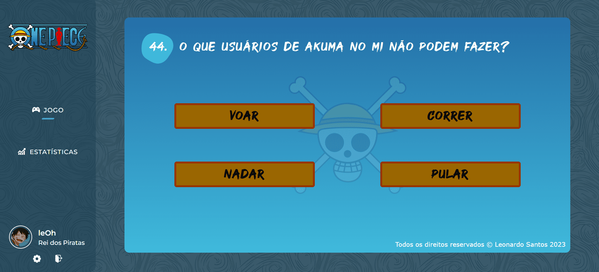
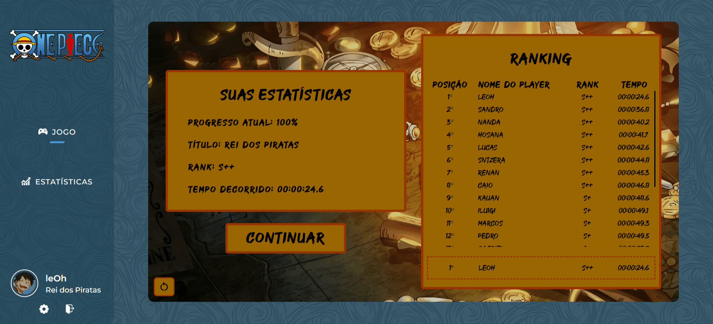
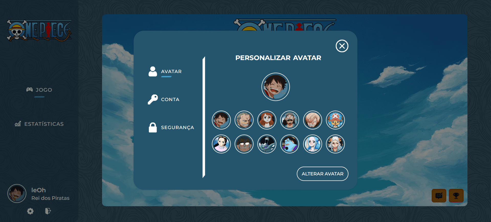

<div align="center">

</div>

<br>

Um projeto totalmente baseado em One Piece, uma obra de extrema importância para mim que vem crescendo significantemente durante os últimos tempos. Aqui você conhecerá um pouco sobre o vasto mundo de One Piece, e poderá se divertir (ou não) com um jogo de perguntas e respostas que desenvolvi para os maiores fãs da obra e também para aqueles que estão começando a se aventurar nesse mundo espetacular de One Piece.

<br>

## 🚀 Tecnologias utilizadas

### Front-end:

<div align="left">


 ### Back-end:


</div>

<br>

## 📷 Screenshots



<br>



<br>



<br>



<br>



<br>



<br>

## ⚙ Instalação local

### Requisitos para a instalação:


### Para a configuração do banco de dados:

- Execute todo esse <a href="project/src/database/one-piece-quiz-script.sql">script</a> para a configuração do banco de dados.

### Instale as dependências do projeto:
```bash
npm i
```

### Após a instalação de todas as dependências:
```bash
npm start
```

### Por fim, para abrir o projeto:

- Acesse a seguinte URL: http://localhost:3333