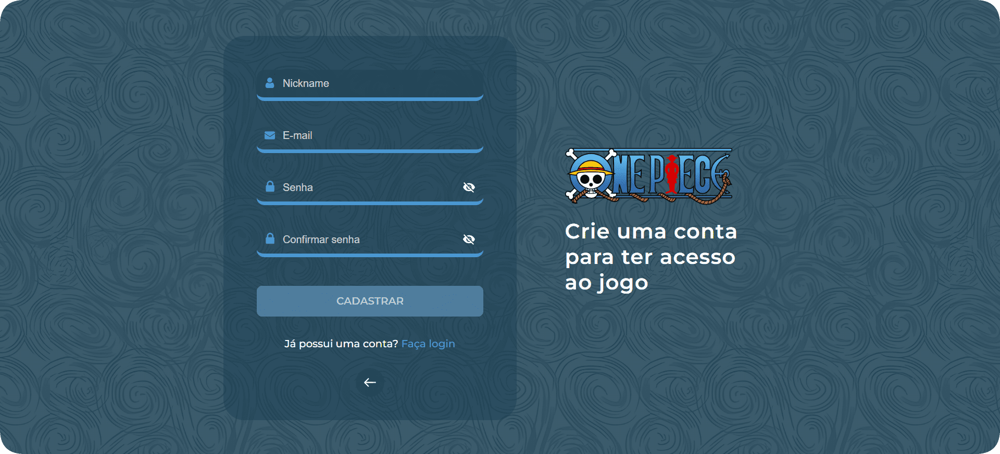
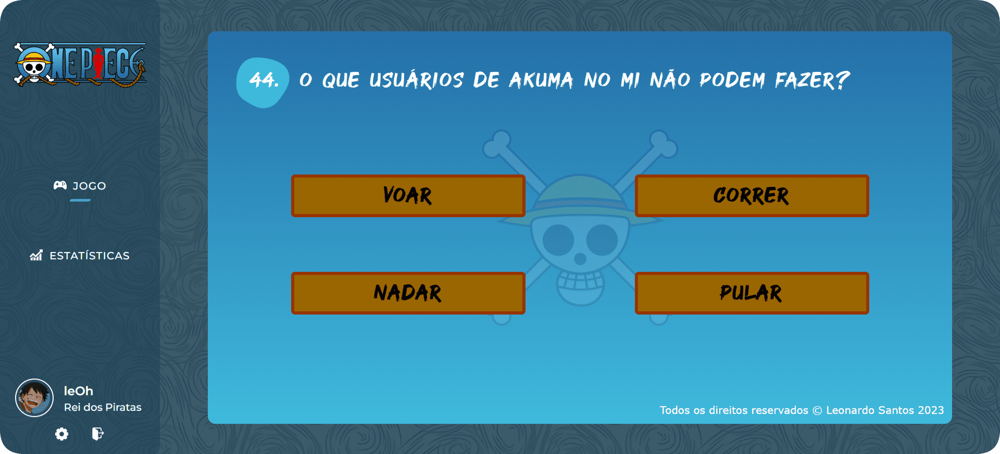
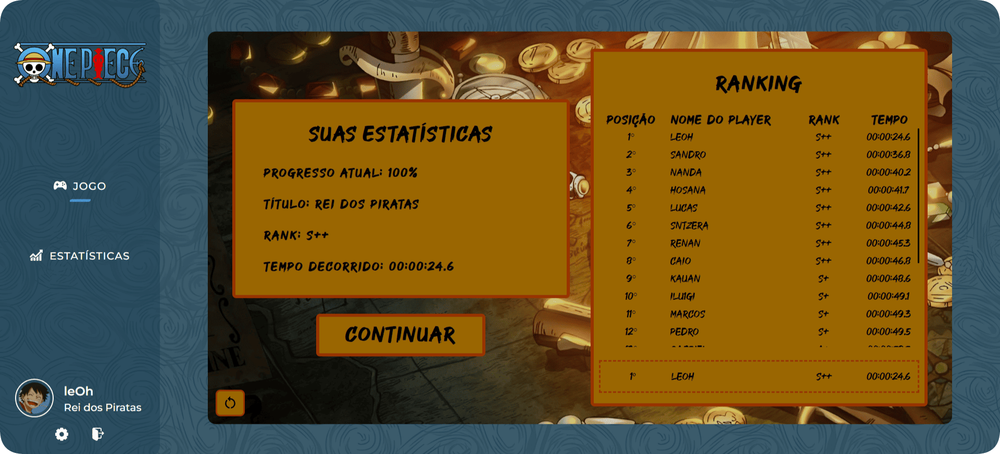

<div align="center">

</div>

<br>

Você já ouviu falar sobre um anime de um suposto pirata que estica? Independente de sua resposta, saiba que agora você está no lugar certo. Aqui irei te mostrar um pouquinho sobre essa obra magnífica que vem crescendo significantemente nesses últimos tempos!

<br>

## 🚀 Tecnologias utilizadas

### Front-end:

<div align="left">


 ### Back-end:


</div>

<br>

## 📷 Screenshots


<br>



<br>


<br>



<br>



<br>


<br>

## ⚙ Instalação local

### Requisitos para instalação:


### Para a criação do banco de dados:

Crie o banco de dados no seu servidor local com esse <a href="project/src/database/one-piece-project-script.sql">script</a>.

### Para instalar as dependências do projeto:
```bash
npm i
```

### Após a instalação de todas as dependências:
```bash
npm start
```

### Por fim, acesse: http://localhost:3333